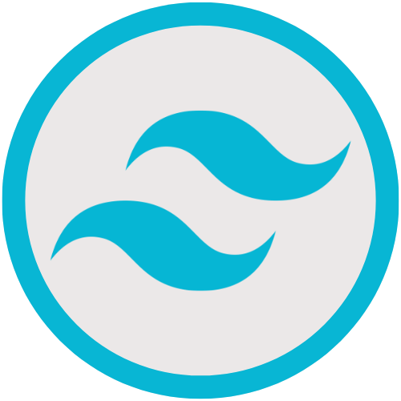
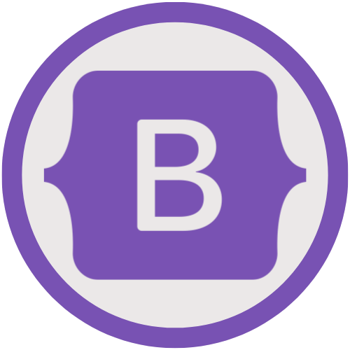

 
  
  
   
 

### Hi there 👋

As a results-driven web developer with a Computer Science degree, I create exceptional websites and web apps that engage users. I specialize in frontend design, using JavaScript (ES6), HTML, CSS, Bootstrap, and TailwindCSS for pixel-perfect, responsive interfaces. On the backend, I excel in Node.js and ExpressJS for robust server applications, integrating MongoDB and MySQL databases for efficient data management. My strong foundation in computer science enhances my problem-solving and performance optimization skills. I'm excited to bring my creativity and dedication to your team, collaborating on projects that drive success and engage your audience. Together, we can transform your web presence into something remarkable.

 

<h3 align="center">Languages and Tools:</h3>

  
  
  
  
  
  
  
  
  
  

 

 

<h3>Projects</h3>
These are the achievements that mean the most to me as I think back on my journey.

|               Project |                                                            |                                                          | Tech                 |
|----------------------:|------------------------------------------------------------|----------------------------------------------------------|----------------------|
|               Personal Website | [Github](https://github.com/AftonLawver/Website) | [Demo](https://www.aftonlawver.com/) | Javascript, Nodejs, ExpressJS, MongoDB |
|     Signature Land Management Website | [Github](https://github.com/AftonLawver/Signature-Land-Management)       | [Demo](https://signature-land-management-bad775a72ef0.herokuapp.com/) | Javascript, Nodejs, ExpressJS, Bootstrap, MongoDB    |
|               Pomodoro Timer Online | [Github](https://github.com/AftonLawver/PomodoroTimerOnline) | [Demo](https://pomodoro-timer-online-634cce94af27.herokuapp.com/) | HTML, CSS, Javascript, jQuery |
##

 

